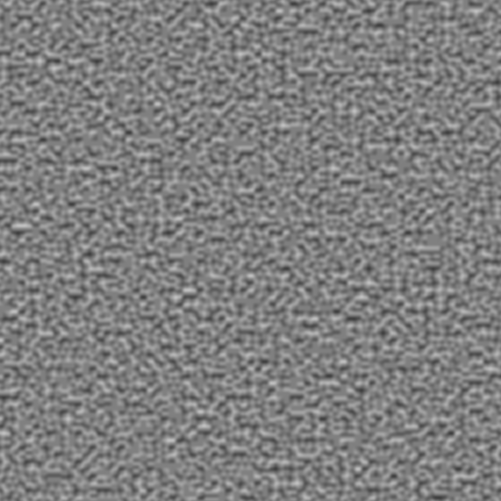
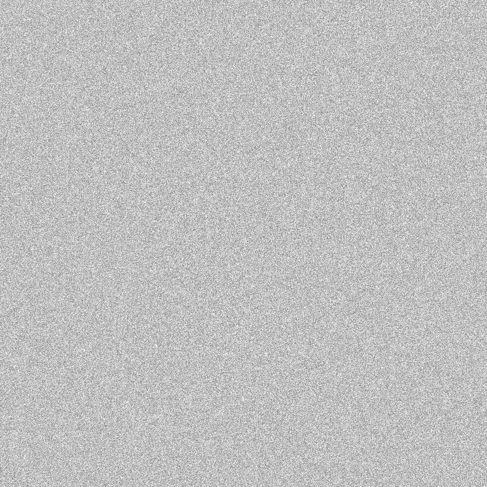
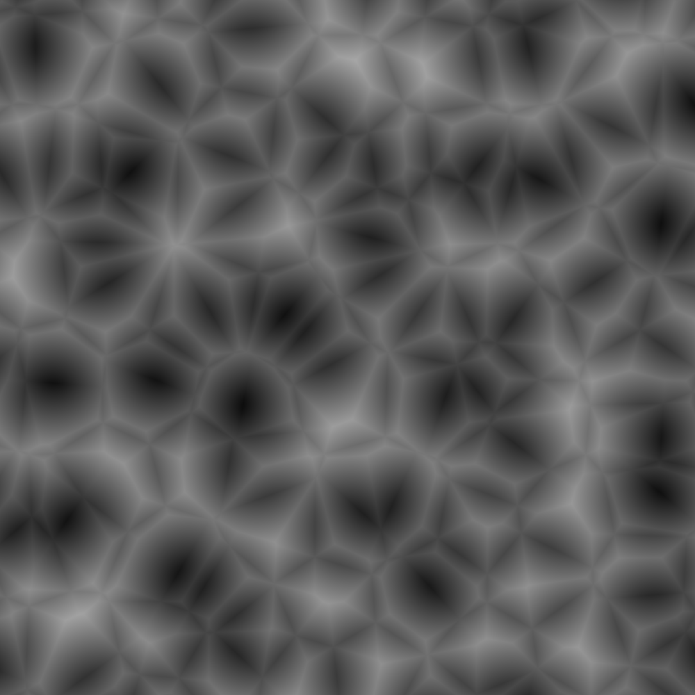
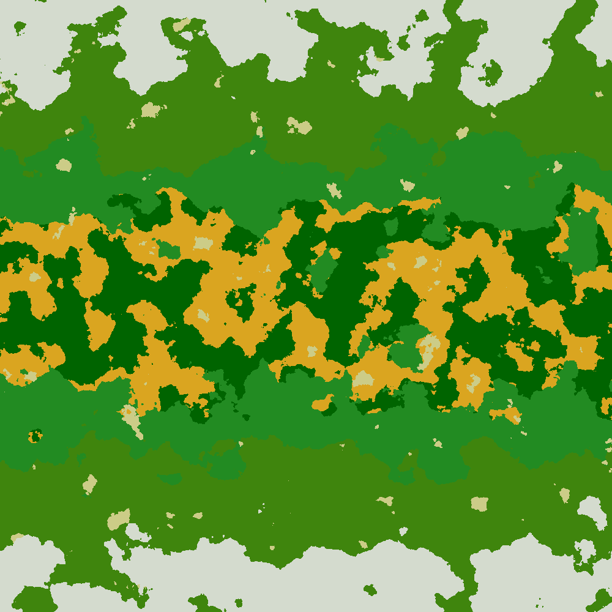

# PerlinNoise

## Overview
PerlinNoise is a .NET project that generates various types of noise images, including Perlin noise, random noise, fractal noise, Worley noise, and biome noise. The project uses SkiaSharp for image generation and Spectre.Console for console interaction.

## Getting Started

### Prerequisites
- .NET 8.0 SDK
- Visual Studio 2022 or later

### Building the Project
To build the project, open a terminal in the project root directory and run:
```sh
dotnet build 
```

## Usage
When you run the project, you will be prompted to select the type of noise to generate. The available options are:

- PerlinNoise
- RandomNoise
- FractalNoise
- WorleyNoise
- BiomeNoise

The generated image will be saved in the `imgs` folder with the corresponding noise type as the filename.

## Code Overview

### [ImageGenerator.cs](src/ImageGenerator.cs)
The `ImageGenerator` class is responsible for generating noise images. It supports multiple noise types and uses SkiaSharp for image creation.

### [Program.cs](src/Program.cs)
The `Program` class contains the main entry point of the application. It uses Spectre.Console to prompt the user for the type of noise to generate.

### [PerlinTest.cs](test/PerlinTest.cs)
The `PerlinTest` class contains unit tests for the Perlin noise generation functionality.

### Example Images
Here are some examples of the generated noise images:

#### Perlin Noise


#### Random Noise


#### Fractal Noise


#### Worley Noise


#### Biome Noise


For more information check: https://github.com/Auburn/FastNoiseLite